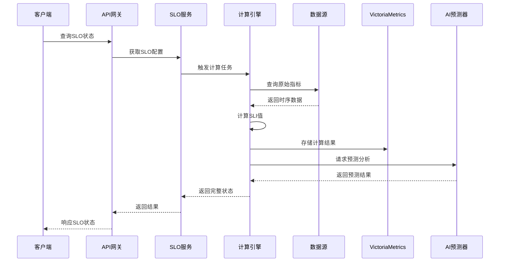
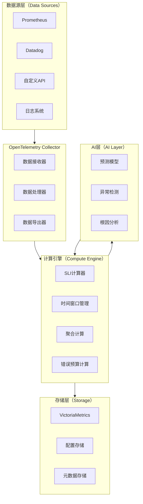
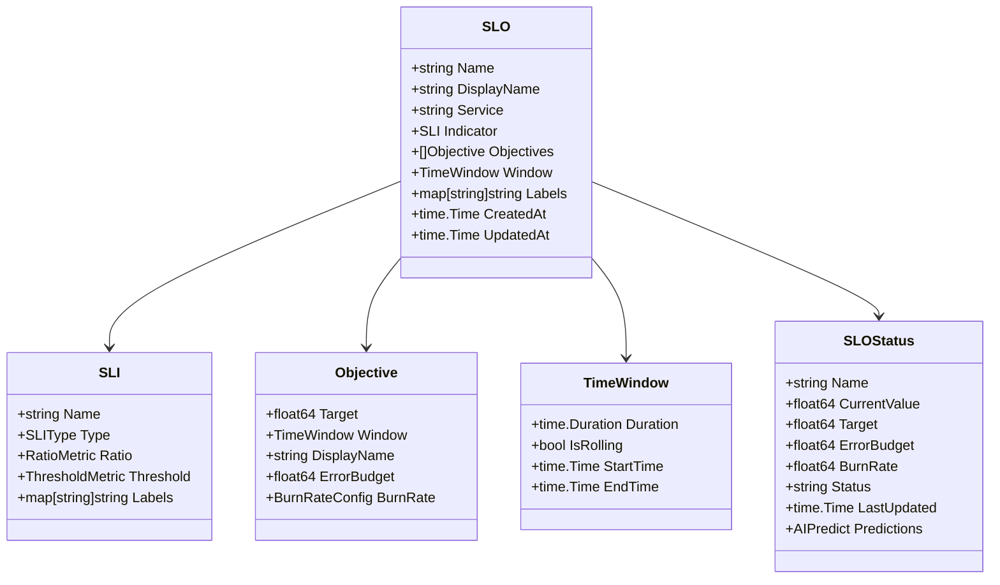
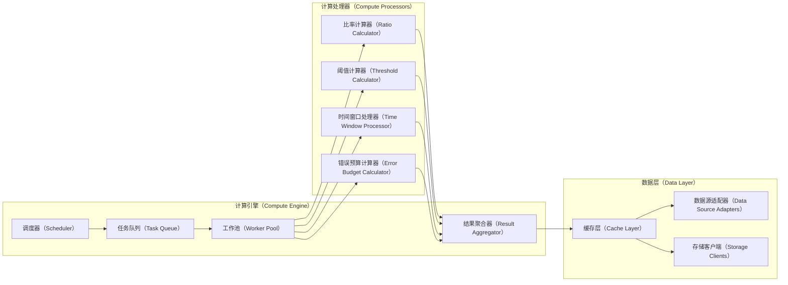
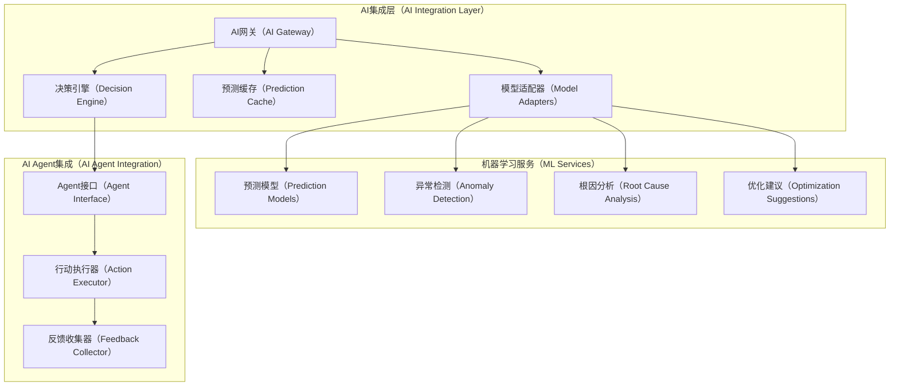
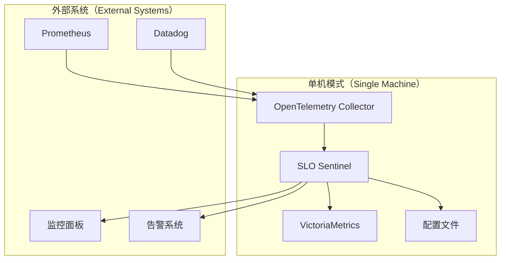
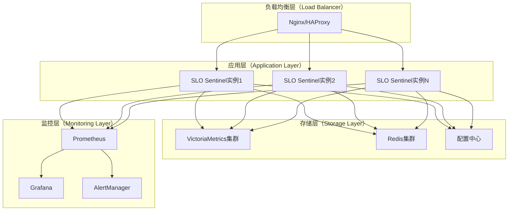

# SLO Sentinel 架构设计文档

## 1. 概述

SLO Sentinel 是一个面向AI时代的高性能SLO监控和执行引擎，作为TBOaaS（可信业务成果即服务）的技术基石。本文档详细阐述了系统的架构设计、技术选型和实现方案。

## 2. 领域问题全景分析

### 2.1 传统SLO监控的痛点

传统SLO监控面临以下核心挑战：

- **厂商锁定问题**：依赖特定监控平台，难以迁移和扩展
- **计算能力限制**：受限于监控系统的计算引擎，无法实现复杂分析
- **数据孤岛现象**：不同监控系统间数据无法有效整合
- **被动响应模式**：只能在问题发生后告警，缺乏预测能力
- **标准化缺失**：缺乏统一的SLO定义和计算标准

### 2.2 AI时代的新需求

随着AI大模型和AI Agent技术的发展，SLO监控需要升级到智能化业务成果保障：

- **预测性分析**：基于历史数据预测SLO违规风险
- **自动化干预**：AI Agent自动执行优化策略
- **因果关系分析**：深度分析影响SLO的根本原因
- **动态目标调整**：根据业务变化智能调整SLO目标

## 3. 解决方案全景

### 3.1 核心设计理念

SLO Sentinel基于以下核心理念设计：

```mermaid
graph TD
    subgraph SP[标准化优先（Standards Priority）]
        SP1[OpenSLO规范兼容]
        SP2[统一数据模型]
        SP3[标准化API接口]
    end
    
    subgraph CS[计算存储分离（Compute-Storage Separation）]
        CS1[独立计算引擎]
        CS2[高性能TSDB存储]
        CS3[弹性伸缩能力]
    end
    
    subgraph PA[插件化架构（Plugin Architecture）]
        PA1[数据源适配器]
        PA2[计算策略插件]
        PA3[AI扩展接口]
    end
    
    subgraph AR[AI就绪（AI Ready）]
        AR1[结构化数据输出]
        AR2[预测分析接口]
        AR3[Agent交互协议]
    end
    
    SP --> CS
    CS --> PA
    PA --> AR
````

### 3.2 技术架构设计

#### 3.2.1 分层架构

```mermaid
graph TD
    subgraph AL[应用层（Application Layer）]
        A1[REST API服务]
        A2[gRPC服务]
        A3[WebSocket服务]
        A4[配置管理服务]
    end
    
    subgraph BL[业务层（Business Layer）]
        B1[SLO应用服务]
        B2[数据源管理服务]
        B3[计算调度服务]
        B4[AI集成服务]
    end
    
    subgraph DL[领域层（Domain Layer）]
        D1[SLO聚合根]
        D2[SLI计算引擎]
        D3[错误预算管理]
        D4[时间窗口管理]
        D5[AI预测引擎]
    end
    
    subgraph IL[基础设施层（Infrastructure Layer）]
        I1[Prometheus适配器]
        I2[Datadog适配器]
        I3[VictoriaMetrics客户端]
        I4[OpenTelemetry集成]
        I5[配置存储]
    end
    
    AL --> BL
    BL --> DL
    DL --> IL
```

#### 3.2.2 核心组件交互



### 3.3 数据流架构



## 4. 技术选型与架构决策

### 4.1 核心技术栈

| 技术领域  | 选择              | 理由                 |
| ----- | --------------- | ------------------ |
| 编程语言  | Go 1.20.2       | 高性能、并发友好、丰富生态      |
| 时序数据库 | VictoriaMetrics | 高性能、PromQL兼容、优异压缩比 |
| 数据集成  | OpenTelemetry   | 标准化、多协议支持、未来兼容     |
| 配置格式  | YAML            | 人类可读、OpenSLO兼容     |
| API框架 | Gin + gRPC      | 高性能HTTP服务 + 高效RPC  |
| 日志系统  | Zap             | 结构化日志、高性能          |

### 4.2 架构约束

#### 4.2.1 性能约束

* **响应时间**：API响应时间 < 100ms (P95)
* **吞吐量**：支持10,000+ SLO并发计算
* **内存使用**：单实例内存使用 < 2GB
* **CPU使用**：CPU使用率 < 80%

#### 4.2.2 可靠性约束

* **可用性**：系统可用性 > 99.9%
* **数据一致性**：最终一致性，容忍短暂不一致
* **故障恢复**：故障恢复时间 < 30秒
* **数据持久性**：数据不丢失，支持备份恢复

#### 4.2.3 可扩展性约束

* **水平扩展**：支持无状态水平扩展
* **插件化**：数据源和计算策略可插拔
* **配置热更新**：支持配置不重启更新
* **版本兼容**：向后兼容性保证

## 5. 详细设计

### 5.1 核心数据模型



### 5.2 计算引擎设计



### 5.3 AI集成架构



## 6. 部署架构

### 6.1 单机部署



### 6.2 分布式部署



## 7. 预期效果与展望

### 7.1 短期目标（6个月内）

* **功能完整性**：实现OpenSLO规范的完整支持
* **性能指标**：单实例支持1000+ SLO并发计算
* **生态集成**：支持主流监控系统（Prometheus、Datadog等）
* **用户体验**：提供直观的YAML配置和REST API

### 7.2 中期目标（1年内）

* **AI能力**：集成基础预测分析功能
* **高可用性**：支持分布式部署和故障恢复
* **性能优化**：响应时间优化到50ms以内
* **社区生态**：建立开源社区和插件生态

### 7.3 长期愿景（2-3年）

* **AI Agent集成**：完整的AI Agent工作流支持
* **自适应系统**：基于AI的自适应SLO目标调整
* **业务成果保障**：完整的TBOaaS能力支持
* **行业标准**：成为SLO监控领域的事实标准

## 8. 风险评估与应对

### 8.1 技术风险

| 风险类型  | 影响程度 | 应对策略           |
| ----- | ---- | -------------- |
| 性能瓶颈  | 高    | 分层缓存、异步处理、水平扩展 |
| 数据一致性 | 中    | 最终一致性设计、冲突解决机制 |
| 依赖风险  | 中    | 多数据源支持、降级策略    |

### 8.2 业务风险

| 风险类型  | 影响程度 | 应对策略         |
| ----- | ---- | ------------ |
| 标准演进  | 低    | 模块化设计、版本兼容策略 |
| 市场竞争  | 中    | 差异化定位、生态建设   |
| 用户接受度 | 中    | 简化配置、完善文档    |

## 参考资料

* \[1] OpenSLO Specification - [https://github.com/OpenSLO/OpenSLO](https://github.com/OpenSLO/OpenSLO)
* \[2] VictoriaMetrics Documentation - [https://docs.victoriametrics.com/](https://docs.victoriametrics.com/)
* \[3] OpenTelemetry Specification - [https://opentelemetry.io/docs/specs/](https://opentelemetry.io/docs/specs/)
* \[4] Prometheus Query Language - [https://prometheus.io/docs/prometheus/latest/querying/](https://prometheus.io/docs/prometheus/latest/querying/)
* \[5] Site Reliability Engineering - [https://sre.google/](https://sre.google/)
